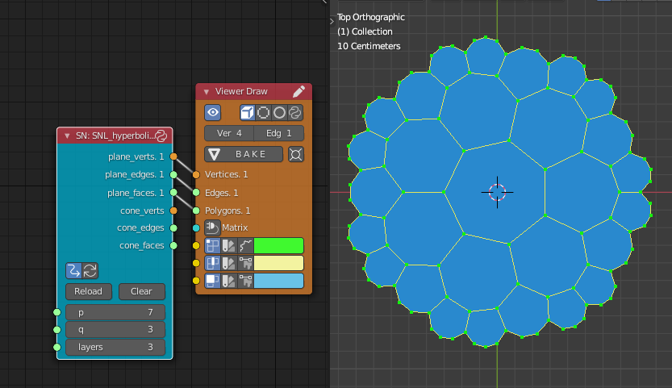
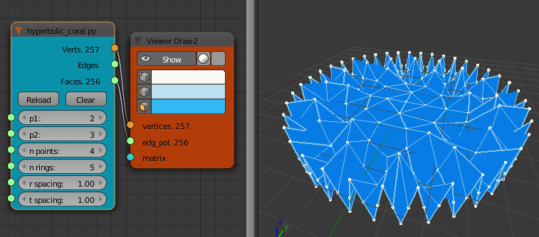
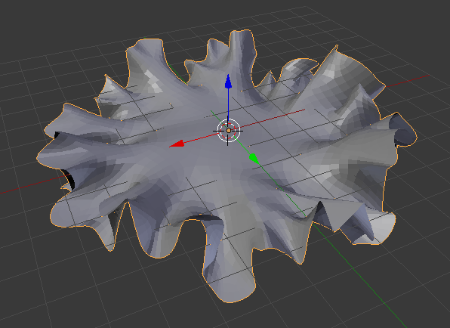
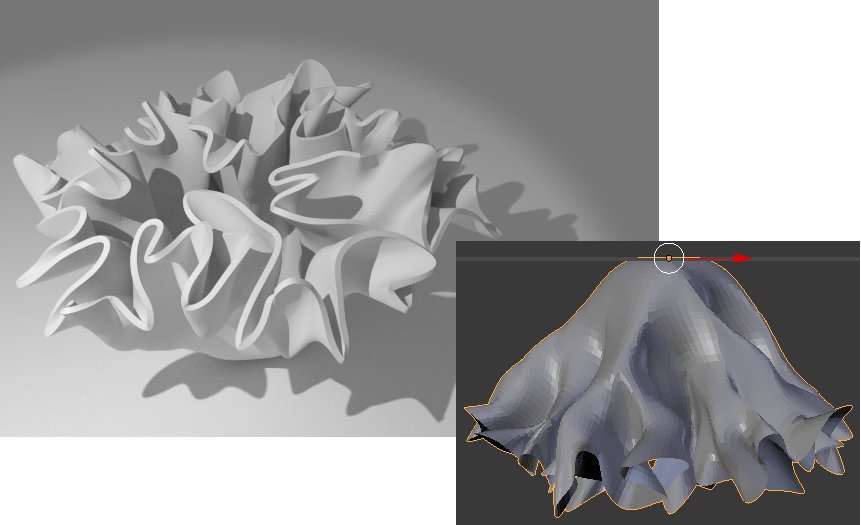

Hyperbolic Coral
==============
Updated to Sverchok vstable7 and Blender 2.91 2021-04-07

`snl_hyperbolic_tiling.py` is the updated code for a Sverchok Scripted Node Lite.
See `hyperbolic_tiling_2.91.blend` for example of use. 



This is  a [Sverchok](http://nikitron.cc.ua/sverchok_en.html) scripted node for use within [Blender](http://www.blender.org).

To use the hyperbolic coral node in Blender first install the [Sverchok](http://nikitron.cc.ua/sverchok_en.html) addon. Download the hyperbolic coral code from [github](https://github.com/elfnor/hyperbolic_coral). Then load the python file as a text blocks into a blend file. Add a "Scripted Node" to a Sverchok node tree. On the node select the ```hyperbolic_coral.py``` code from the lower drop down. Then click the plugin icon to the right of this field. The node should turn blue with some inputs and outputs. Wire the "Verts" and "Faces" outputs to a "Viewer Draw" node and you should see some geometry as below.



After applying a cloth modifier and a subdivion modifier:



Or pinning some vertices:



See [Look, Think, Make](http://elfnor.com/blender-adventures-with-hyperbolic-planes.html) for more details.

